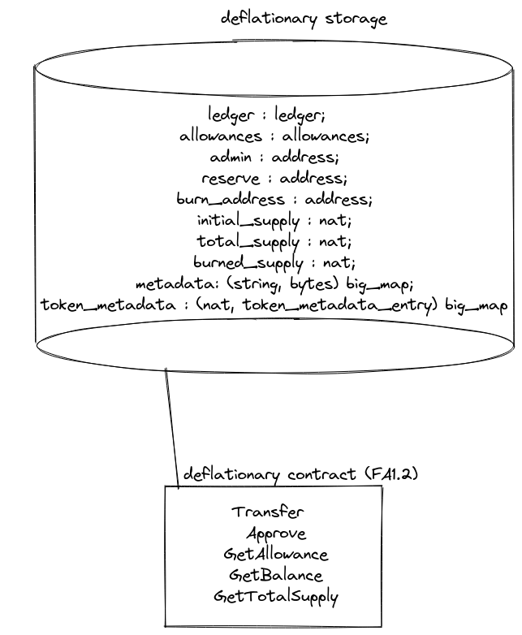

# Anti-Token : The first deflationary token
### *This is a description of the SmartLink deflationary token in LIGO !*

#### Introduction

The system is comprised of a deflationnary "mechanical" FA12 token contract.

In order to incentivize people using the token in Smart-Contrat, a fee is taken if the receiver of a transfer is a user.

| Attribute | Value | 
|---|---|
| Name | Anti token | 
| Decimal |	3 | 
| Symbol	| ANTI | 
| Description	| A Deflationary token for https://smartlink.so/ the Decentralized escrow platform for Web 3.0 | 
| Interface	| TZIP-007 TZIP-016 | 
| Authors	| SmartLink Dev Team | 
| Homepage	| https://smartlink.so/ | 
| Icon	| ipfs://QmRPwZSAUkU6nZNor1qoHu4aajPHYpMXrkyZNi8EaNWAmm | 
| Initial supply |	777 777 777 777.777 | 
| Mintable	| FALSE | 
| Admin | tz1ic7L44bmZc9xjmLf8FbxMJPJtHPgA5csv | 
| Reserves | tz1djkbrkYiuWFTgd3qUiViijGUuz2wBGxQ2 | 
| Burn address | tz1burnburnburnburnburnburnburjAYjjX | 


## A. Installation

#### I. Dependancies
- You need to install docker and npm first
- `npm i`

#### II. Compilation of the ANTI Token .tz
- At root, with docker run :
`docker run --rm -v "$PWD":"$PWD" -w "$PWD" ligolang/ligo:next compile contract contract/anti.mligo > contract/compiled/anti.tz`

#### III. Prepare deployment of the ANTI Token
- At root, with docker run :
`docker run --rm -v "$PWD":"$PWD" -w "$PWD" ligolang/ligo:next compile contract contract/anti.mligo --michelson-format json > deploy/anti.json`
- Go to deploy/deploy.ts and choose your network, and put your private key. You can change the configuration if needed.

#### IV. Deployment
- At root, run :
`tsc deploy/deploy.ts --resolveJsonModule -esModuleInterop`
- And then when the deploy.js file is created, run :
`node deploy/deploy.js`


## B. System Architecture



#### I. The ANTI Token

The ANTI token can be used as any other FA12 asset, and is not mintable. The amount of the taxe is 7% burn and 1% sent to reserve.

#### II. Finding Smart-Contract

In order to find if the receiver of the token is a contract, the ANTI token will check the 6th bytes of the internal representation of an address type.

```
  let is_address_implicit(elt: address) : bool = 
      let pack_elt : bytes = Bytes.pack elt in
      let is_imp : bytes = Bytes.sub 6n 1n pack_elt in
      ( is_imp = 0x00 )
  in
```


#### III. About

The mechanical token is a genuine and innovative idea of Smart-Chain.
